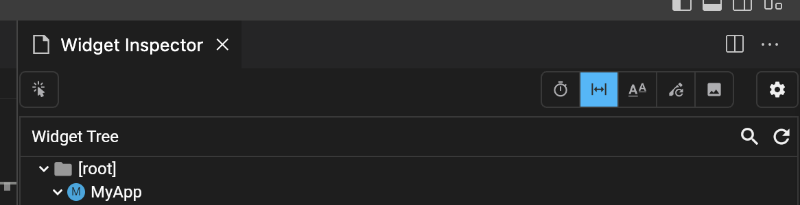

# debugPaintSizeEnabled

## デバッグ用の記述

- `debugPaintSizeEnabled` を `true` にすることで、レイアウトガイドを表示することができる.
- releaseビルドだとどうなる？

```dart
// パッケージを追加
import 'package:flutter/rendering.dart';

void main() {
  debugPaintSizeEnabled = true; // 追加.
  runApp(MyApp());
}
```

## VSCode ならボタン一発でいけそう

- VSCodeで有線接続している状態なら、メニューボタンで同じことが可能
- 配布時などはコードで、手元で確認するならボタンで、使い分けると良さそう

