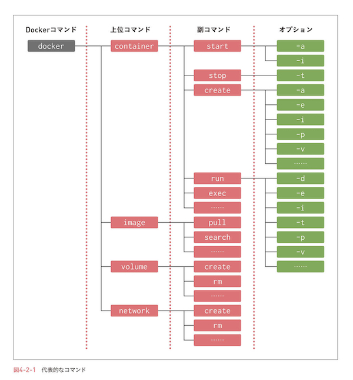
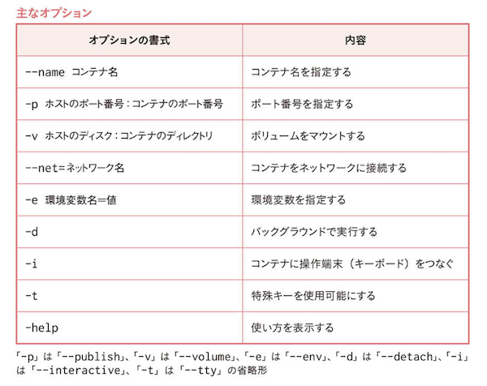
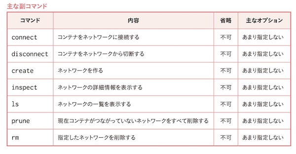
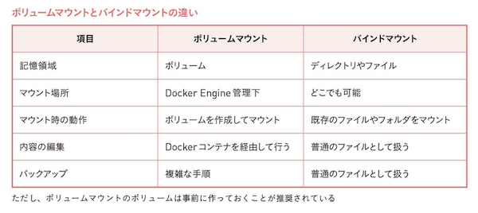
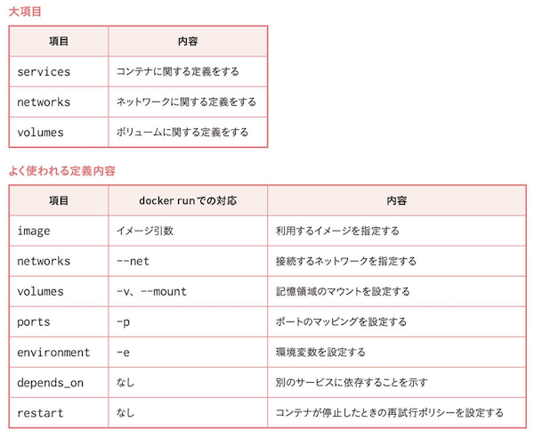

# docker

<!-- @import "[TOC]" {cmd="toc" depthFrom=1 depthTo=6 orderedList=false} -->

<!-- code_chunk_output -->

- [docker](#docker)
  - [インストール](#インストール)
  - [コマンド](#コマンド)
    - [イメージのダウンロード](#イメージのダウンロード)
    - [コンテナの作成](#コンテナの作成)
    - [コンテナの開始](#コンテナの開始)
    - [コンテナの起動](#コンテナの起動)
    - [そのほか](#そのほか)
    - [主なオプション](#主なオプション)
  - [ネットワーク](#ネットワーク)
    - [主なオプション](#主なオプション-1)
  - [MySQLとWordPressの参考](#mysqlとwordpressの参考)
  - [コンテナとホスト間でファイルコピー](#コンテナとホスト間でファイルコピー)
  - [ボリュームのマウント](#ボリュームのマウント)
    - [種類は２つ](#種類は2つ)
    - [バインドマウント](#バインドマウント)
    - [ボリュームマウント](#ボリュームマウント)
  - [コンテナのイメージ化](#コンテナのイメージ化)
    - [イメージの作り方は２つ](#イメージの作り方は2つ)
    - [commit で作成](#commit-で作成)
    - [Dockerfile で作成](#dockerfile-で作成)
  - [Docker Compose](#docker-compose)
    - [Dockerfileとの違い](#dockerfileとの違い)
    - [docker-compose.yml](#docker-composeyml)
    - [Docker Compose の実行](#docker-compose-の実行)
    - [サンプル](#サンプル)

<!-- /code_chunk_output -->

---

## インストール

- brew cask でインストール

```bash
$ brew install docker --cask
```

---

## コマンド



###　イメージのダウンロード

```bash
# penguin という名前のイメージを pull(ダウンロード) したい場合
$ docker image pull penguin

# 省略形もOK
$ docker pull penguin
```

### コンテナの作成

```bash
$ docker container create
```

### コンテナの開始

```bash
# penguin という名前のイメージをコンテナとして start(開始) したい場合
$ docker container start penguin

# 省略形もOK
$ docker start penguin
```

### コンテナの起動

- `pull`, `create`, `start` をまとめて実行する？
- こっちの方が一般的っぽい

```bash
# penguin という名前のイメージを container として run したい場合
$ docker container run penguin

# 省略形もOK
$ docker run penguin

# apache のイメージをダウンロードし、apa000ex1 というコンテナを作成し、バックグラウンドで起動する
$ docker run --name apa000ex1 -d httpd

# ポートを指定しないとアクセスできない場合はポートを指定
$ docker run --name apa000ex2 -d -p 8080:80 httpd

# nginx もapacheとほとんど同じ
$ docker run --name nginx000ex6 -d -p 8084:80 nginx

# mysql はパスワードの設定が必須（本当はもっと設定が必要）
$ docker run --name mysql000ex7 -dit -e MYSQL_ROOT_PASSWORD=password1234 mysql
```

### そのほか

```bash
# コンテナの停止
$ docker container stop apa000ex1

# コンテナの削除
$ docker container rm apa000ex1
```

### 主なオプション



---

## ネットワーク

```bash
# ネットワークを作成する
$ docker network create xxxx
```

### 主なオプション



---

## MySQLとWordPressの参考

| 項目 | 設定値 |
| --- | ----- |
| network | my_network |
| mysqlコンテナ | my_mysql_container |
| wordpressコンテナ | my_wp_container |
| mysqlルートパス | my_mysql_root_pass |
| mysqlDB名 | my_mysql_db_name |
| mysqlユーザ名 | my_mysql_user_name |
| mysqlパス | my_mysql_pass |
| port | 8081:80 |

```bash
# ネットワークの作成
$ docker network create my_network

# MySQLのコンテナ作成
$ docker run --name my_mysql_container -dit -e MYSQL_ROOT_PASSWORD=my_mysql_root_pass -e MYSQL_DATABASE=my_mysql_db_name --net=my_network -e MYSQL_USER=my_mysql_user_name -e MYSQL_PASSWORD=my_mysql_pass mysql --character-set-server=utf8mb4 --collation-server=utf8mb4_unicode_ci --default-authentication-plugin=mysql_native_password

# WordPressのコンテナ作成
$ docker run --name my_wp_container -dit --net=my_network -p 8081:80 -e WORDPRESS_DB_NAME=my_mysql_db_name -e WORDPRESS_DB_HOST=my_mysql_container -e WORDPRESS_DB_USER=my_mysql_user_name -e WORDPRESS_DB_PASSWORD=my_mysql_pass wordpress
```

---

## コンテナとホスト間でファイルコピー

```bash
# パソコンからコンテナにコピー
$ docker cp /Users/hoshi005/Downloads/index.html apa000ex19:/usr/local/apache2/htdocs/

# コンテナからパソコンにコピー
$ docker cp apa000ex19:/usr/local/apache2/htdocs/index.html /Users/hoshi005/Downloads/
```

---

## ボリュームのマウント

### 種類は２つ

- ボリュームマウント
  - Docker Engine の管理内にボリュームを作成する
- バインドマウント
  - Docker Engine の外（普通にパソコンの中）にボリュームを作成する



### バインドマウント

```bash
# -v で、パソコン上のディレクトリとマウント先のパスを指定する
$ docker run --name apa000ex20 -d -p 8090:80 -v /Users/hoshi005/Desktop/app_dir:/usr/local/apache2/htdocs httpd
```

Apacheに Flutter Docs を展開することも可能

```bash
# まずはhonkitのビルド
$ npx honkit build

# ビルドしたHTML群をhtdocsとして指定
$ docker run --name honkit -d -p 8070:80 -v /Users/hoshi005/Documents/プログラミング/Flutter勉強中/flutter_docs/_book:/usr/local/apache2/htdocs httpd
```

### ボリュームマウント

事前にボリュームを作成する。あとはバインドマウントとおおよそ同じ

```bash
# ボリュームを作成
$ docker volume create my_volume

# コンテナを作成
$ docker run --name hoge -d -p 8080:80 -v my_volume::/usr/local/apache2/htdocs httpd
```

---

## コンテナのイメージ化

### イメージの作り方は２つ

- すでにあるコンテナを `commit` でイメージの書き出しを行う
- `Dockerfile` でイメージを作る

### commit で作成

```bash
# 適当にコンテナを作る
$ docker run --name hoge -d -p 8080:80 httpd
# commit する
$ docker commit hoge hoge_image
```

- コンテナ`hoge`からイメージ`hoge_imgae`が造られる
- 事前にファイルをコピーしたコンテナをイメージ化しておけば、ファイルごとイメージになる
- ポートなどの設定は、イメージには含まれない

### Dockerfile で作成

- `Dockerfile` というファイルを作成しておく

```dockerfile
FROM httpd
COPY index.html /usr/local/apache2/htdocs/
```

- `docker build` コマンドでイメージの作成が可能

```bash
$ docker build -t [イメージ名] [Dockerfileを含んだフォルダ]
```

---

## Docker Compose

- 構築に関わるコマンドの内容を１つのテキストファイルにまとめたもの
- 一気に実行したり、停止・破棄も一度に行うことが可能
- 定義ファイルに対して `up` を行うことで、環境が構築される
- 定義ファイルに対して `down` を行うことで、構築された環境が破棄される
  - コンテナやネットワークは破棄される
  - イメージやボリュームは残る
- 本来はDockerEngineとは別にインストールが必要
  - Win / Mac 版にはすでに入っている

### Dockerfileとの違い

- Docker Compose
  - **環境を作る**
  - ネットワークやボリュームも併せて作成可能
- Dockerfile
  - **imageを作る**
  - ネットワークやボリュームは作れない

### docker-compose.yml

```yaml
version: "3" # docker compose のバージョン情報
services: # コンテナの情報
  コンテナ名1:
    image: イメージ名
    networks:
      - ネットワーク名
    ports:
      - ポートの設定
  コンテナ名2:
    image: イメージ名
networks: # ネットワークの情報
  ネットワーク名1:
volumes: # ボリュームの情報
  ボリューム名1:
  ボリューム名2:
```



- `depends_on`
  - 依存関係
  - **コンテナA** の項目に `depends_on: - コンテナB` とあれば、まず先に **コンテナB** から作られる
- `env_file`
  - 設定ファイルのパス
  - `-e`, `environment` で指定する内容を外出しするイメージ
- `platform: linux/x86_64`
  - M1チップのプラットフォームは `arm64`
  - `mysql5.7*` のイメージのサポートプラットフォームが `AMD64`

### Docker Compose の実行

```bash
# upで実行.
$ docker-compose -f 定義ファイルのパス up オプション
# 設定ファイルのディレクトリなら、`-f`は不要
$ docker-compose up -d

# downで終了.
$ docker-compose down
# `-v`をつければ、volume も削除される
$ docker-compose down -v

# stopで停止.
$ docker-compose stop
```

### サンプル

- WordPressとMySQL
- `environment`は`env_file`にして、別ファイルにしてもよい

```yaml
version: '3'
services:
  mysql000ex11:
    platform: linux/x86_64
    image: mysql:5.7
    networks:
      - wordpress000net1
    volumes:
      - mysql000vol11:/var/lib/mysql
    restart: always
    # environment:
    #   - MYSQL_ROOT_PASSWORD=myrootpass
    #   - MYSQL_DATABASE=wordpress000db
    #   - MYSQL_USER=wordpress000kun
    #   - MYSQL_PASSWORD=wkunpass
    env_file:
      - ./env/mysql.env
  wordpress000ex12:
    depends_on:
      - mysql000ex11
    image: wordpress
    networks:
      - wordpress000net1
    volumes:
      - wordpress000vol12:/var/www/html
    ports:
      - 8087:80
    restart: always
    environment:
      - WORDPRESS_DB_HOST=mysql000ex11
      - WORDPRESS_DB_NAME=wordpress000db
      - WORDPRESS_DB_USER=wordpress000kun
      - WORDPRESS_DB_PASSWORD=wkunpass
networks:
  wordpress000net1:
volumes:
  mysql000vol11:
  wordpress000vol12:
```

- mysql.env はこんな感じ

```env
MYSQL_ROOT_PASSWORD=myrootpass
MYSQL_DATABASE=wordpress000db
MYSQL_USER=wordpress000kun
MYSQL_PASSWORD=wkunpass
```