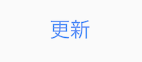
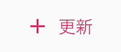
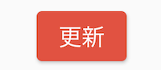
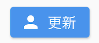
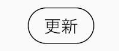
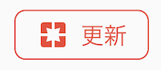
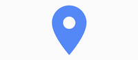
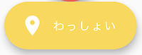

# Button

[参考になるサイト](https://zenn.dev/coka01/articles/cb0b632766138e9858e7)

## TextButton



```dart
TextButton(
  onPressed: _handlePressed,
  style: TextButton.styleFrom(primary: Colors.red),
  child: Text(
    "更新",
    style: TextStyle(color: Colors.blueAccent, fontSize: 20),
  )
)
```

アイコン付きはこちら.



```dart
TextButton.icon(
  onPressed: _handlePressed,
  icon: Icon(
    Icons.add,
    color: Colors.pink,
  ),
  label: Text(
    "更新",
    style: TextStyle(color: Colors.pink, fontSize: 20),
  )
)
```

## ElevatedButton



```dart
ElevatedButton(
  onPressed: _handlePressed,
  style: ElevatedButton.styleFrom(primary: Colors.red),
  child: Text(
    "更新",
     style: TextStyle(color: Colors.white, fontSize: 20),
  )
)
```

アイコン付きはこちら



```dart
ElevatedButton.icon(
  onPressed: _handlePressed,
  icon: Icon(
    Icons.person,
    color: Colors.white,
  ),
  label: Text(
    "更新",
    style: TextStyle(color: Colors.white, fontSize: 20),
  )
)
```

## OutlinedButton



```dart
OutlinedButton(
  onPressed: _handlePressed,
  style: OutlinedButton.styleFrom(
    primary: Colors.black,
    shape: RoundedRectangleBorder(
      borderRadius: BorderRadius.circular(20)),
    side: BorderSide()),
  child: Text(
    "更新",
    style: TextStyle(fontSize: 20),
  )
)
```

アイコン付きはこちら



```dart
OutlinedButton.icon(
  onPressed: _handlePressed,
  style: OutlinedButton.styleFrom(
    primary: Colors.red,
    shape: RoundedRectangleBorder(
      borderRadius: BorderRadius.circular(8),
    ),
    side: BorderSide(color: Colors.red),
  ),
  icon: Icon(
    Icons.pages,
    color: Colors.red,
  ),
  label: Text(
    "更新",
    style: TextStyle(color: Colors.red, fontSize: 20),
  )
)
```

## IconButton



```dart
IconButton(
  icon: Icon(Icons.room),
  onPressed: _handlePressed,
  color: Colors.blueAccent,
  iconSize: 50,
  padding: const EdgeInsets.all(10),
),
```

## FloatingActionButton


```dart
FloatingActionButton(
  onPressed: _handlePressed,
  backgroundColor: Colors.redAccent,
  child: Icon(Icons.room),
)
```

ラベルを含める場合はこちら.



```dart
FloatingActionButton.extended(
  onPressed: _handlePressed,
  backgroundColor: Colors.amberAccent,
  label: Text("わっしょい"),
  icon: Icon(Icons.room),
)
```
