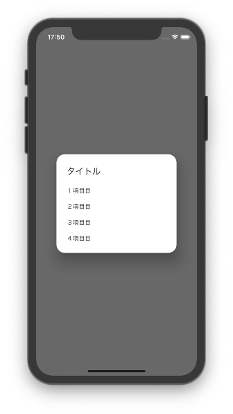
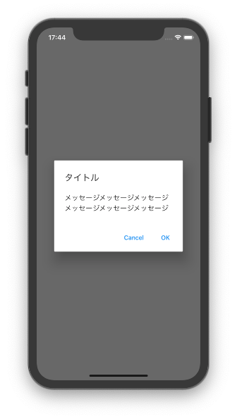

# ダイアログ

- [ダイアログの種類と使い分け方をカチッとまとめる](https://qiita.com/coka__01/items/4c1aea5fb1646e463f91#cupertinoalertdialog)

## ダイアログの種類

- `SimpleDialog`
  - 選択肢から選ぶパターン
- `AlertDialog`
  - ボタン、もしくは`TextField`などのカスタム

## 開く時

- ダイアログを表示するときは`showDialog()`メソッドを利用する.
- これはどのタイプのダイアログでも共通

## SimpleDialog



```dart
showDialog(
  context: context,
  builder: (context) {
    return SimpleDialog(
      title: Text("タイトル"),
      children: <Widget>[
        // コンテンツ領域
        SimpleDialogOption(
          onPressed: () => Navigator.pop(context),
          child: Text("１項目目"),
        ),
          :
          :
      ],
    );
  },
);
```

## AlertDialog



```dart
showDialog(
  context: context,
  builder: (_) {
    return AlertDialog(
      title: Text("タイトル"),
      content: Text("メッセージメッセージメッセージメッセージメッセージメッセージ"),
      actions: <Widget>[
        // ボタン領域
        TextButton(
          child: Text("Cancel"),
          onPressed: () => Navigator.pop(context),
        ),
        TextButton(
          child: Text("OK"),
          onPressed: () => Navigator.pop(context),
        ),
      ],
    );
  },
);
```