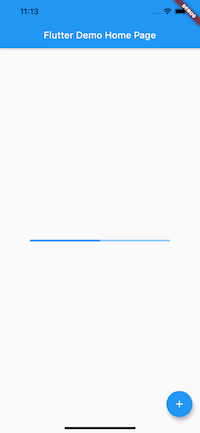
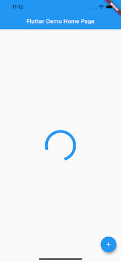

# プログレスバー

## 直線

```dart
SizedBox(
  width: 300,
  child: LinearProgressIndicator(
    value: 0.5,
  ),
),
```



## 円環

```dart
SizedBox(
  width: 100,
  height: 100,
  child: CircularProgressIndicator(
    strokeWidth: 10,
  ),
)
```


